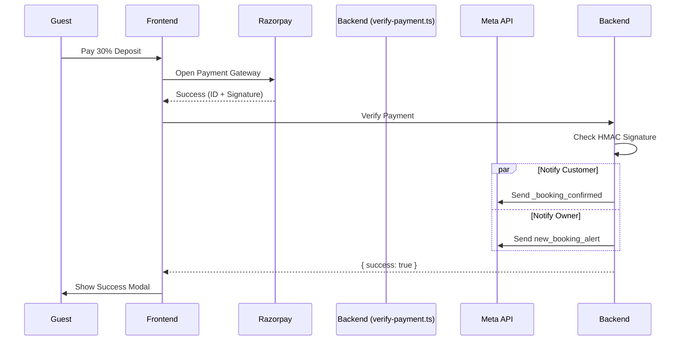

# WhatsApp Automation Overview — Al Baith Rest House

This document provides a comprehensive technical overview of the WhatsApp notification system integrated into the Al Baith Rest House booking platform.

## 🚀 Architecture and Trigger Flow

The system uses a **Backend-Only Trigger** model to ensure reliability and prevent duplicate messages.

1.  **Payment Verification**: When a guest completes a Razorpay payment, the frontend calls the `/api/verify-payment` serverless function.
2.  **Signature Check**: The backend verifies the Razorpay signature to ensure the payment is authentic.
3.  **Notification Trigger**: On successful verification, the backend automatically triggers two WhatsApp messages via the **Meta WhatsApp Business API (Cloud API v21.0)**.
4.  **Non-Blocking**: Notifications are sent asynchronously; if WhatsApp fails, the user still sees their booking confirmation on the website.

## 🔑 Environment Variables (Standardized)

The following variables must be set in both `.env` (local) and **Vercel Dashboard** (production):

| Variable Name | Description | Example / Current Value |
| :--- | :--- | :--- |
| `WHATSAPP_ACCESS_TOKEN` | Meta Permanent Access Token | `EAATGo8...` |
| `WHATSAPP_PHONE_NUMBER_ID` | WhatsApp Phone Number ID | `995916900282584` |
| `WHATSAPP_OWNER_PHONE` | Number to receive owner alerts | `918589003444` |

> [!IMPORTANT]
> **Consolidation Fix**: Previously, the system was confused by mixed names like `WHATSAPP_TOKEN` and `OWNER_WHATSAPP`. These have all been unified to the names above.

## 📝 WhatsApp Templates

The system uses two pre-approved Meta templates:

### 1. `_booking_confirmed` (Customer)
Sent to the person who booked the room.
*   **Variables**:
    1.  `{{1}}`: Guest Name
    2.  `{{2}}`: Listing/Room Title
    3.  `{{3}}`: Check-in Date (Formatted: 18 Apr 2026)
    4.  `{{4}}`: Check-out Date
    5.  `{{5}}`: Deposit Amount Paid (e.g., ₹1050)

### 2. `new_booking_alert` (Owner)
Sent to the hotel owner (`WHATSAPP_OWNER_PHONE`).
*   **Variables**:
    1.  `{{1}}`: Guest Name
    2.  `{{2}}`: Room Title
    3.  `{{3}}`: Check-in Date
    4.  `{{4}}`: Check-out Date

## 🛠️ Data Handling and Formatting

*   **Phone Numbers**: Smart formatting handles both 10-digit inputs and prefixed numbers. It automatically prepends `91` if only 10 digits are provided and strips non-numeric characters.
*   **Dates**: Dates are converted to the `en-IN` locale (e.g., "18 Apr 2026") before being sent to WhatsApp for better readability.
*   **API Version**: Currently using **v21.0** of the Facebook Graph API via `api/utils/sendWhatsApp.js`.

## 🔍 Logging and Troubleshooting

To debug issues, check the **Vercel Logs** for the `verify-payment` function.

*   **Success**: You will see `✅ Customer WhatsApp sent: message_id` and `✅ Owner WhatsApp sent: message_id`.
*   **Failure**: Errors from the Meta API are logged with full detail.
*   **Config Status**: On every payment verification, the system logs whether the 3 required environment variables are set (`✅ set` or `❌ missing`).

## ⚠️ Known Fixes Applied (April 2026)
1.  **Removed Duplicate Calls**: The frontend no longer calls `/api/notify`. All logic is now centralized in `verify-payment.ts`.
2.  **Fixed Env Var Corruption**: Removed literal `\n` characters that were appended to secrets in the Vercel dashboard.
3.  **Corrected Variable Names**: All code now points to `WHATSAPP_ACCESS_TOKEN` instead of the legacy `WHATSAPP_TOKEN`.
